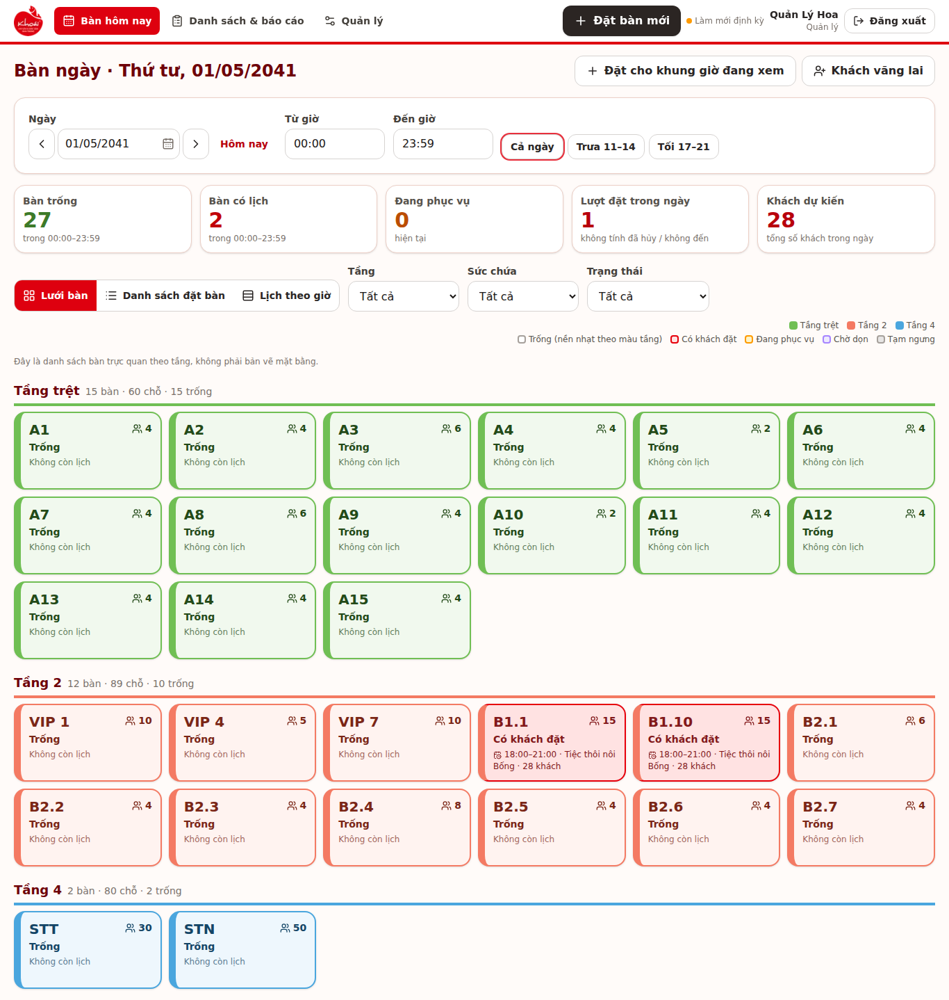
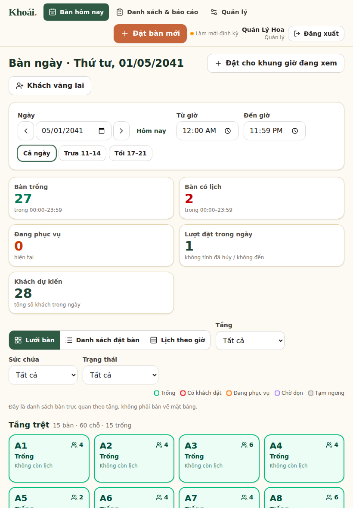
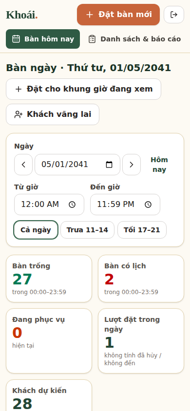

# Khoái — Quản lý bàn & đặt tiệc

Ứng dụng web **nội bộ** cho lễ tân và Sales nhà hàng Khoái: xem bàn trống theo ngày/giờ, đặt bàn – đặt tiệc, khách vãng lai, đổi bàn/đổi giờ, theo dõi cọc, tìm kiếm, xuất Excel, nhiều nhân viên dùng cùng lúc trên cùng một cơ sở dữ liệu.

> Tài liệu liên quan: [Hướng dẫn cho lễ tân](docs/HUONG_DAN_LE_TAN.md) · [Sao lưu & phục hồi](docs/SAO_LUU_PHUC_HOI.md) · [Kết quả kiểm thử](docs/KET_QUA_KIEM_THU.md)

## 1. Kiến trúc tóm tắt

```
Trình duyệt (laptop / tablet / điện thoại)
   │  HTTPS
   ▼
Vercel ── Next.js 16 (App Router, TypeScript, Tailwind CSS 4)
   │        • proxy.ts: chặn mọi truy cập chưa đăng nhập (trang + API)
   │        • Server Actions / Route Handlers: chạy với PHIÊN ĐĂNG NHẬP của người dùng
   ▼
Supabase
   ├─ Auth        : tài khoản riêng từng người, không mở đăng ký công khai
   ├─ PostgreSQL  : dữ liệu dùng chung. Quy tắc nghiệp vụ nằm TRONG CSDL
   │                • ràng buộc loại trừ (EXCLUDE) chống trùng lịch theo từng bàn
   │                • hàm RPC nguyên tử (một giao dịch): tạo/sửa/đổi bàn/đổi trạng thái
   │                • RLS + phân quyền hàm: chỉ nhân viên còn hoạt động mới đọc/ghi
   │                • nhật ký chỉ ghi thêm (không sửa/xóa được)
   └─ Realtime    : các máy khác tự cập nhật (có thêm làm mới định kỳ dự phòng)
```

Điểm thiết kế quan trọng

| Yêu cầu | Cách thực hiện |
|---|---|
| Một bàn không có hai lượt giữ chỗ giao nhau | `EXCLUDE USING gist (table_id WITH =, during WITH &&) WHERE (holds)` trên `booking_tables`; khoảng `[bắt đầu, kết thúc)` + đệm dọn bàn cấu hình được |
| Hai người đặt cùng bàn cùng lúc → chỉ một thành công | Do ràng buộc ở CSDL; người sau nhận `E_OVERLAP` kèm lượt đang giữ chỗ |
| Đặt nhiều bàn: thành công toàn bộ hoặc không gì cả | Cả thao tác nằm trong **một** hàm/giao dịch |
| Không ghi đè âm thầm | Cột `version`; mọi lần sửa phải gửi đúng phiên bản đã xem, lệch → `E_VERSION` |
| Bấm lưu nhiều lần không tạo trùng | Mỗi lần lưu có `request_id`; CSDL nhớ kết quả (`idempotency_keys`) |
| Mất mạng không báo thành công giả | Giao diện chỉ báo “Đã lưu” sau khi máy chủ xác nhận |
| Phân quyền | RLS + thu hồi quyền ghi trực tiếp; mọi ghi qua hàm RPC có kiểm tra vai trò |
| Không xóa cứng | Giao diện chỉ có *Hủy*; API không có quyền `DELETE` |

Trạng thái lượt đặt: *Chờ xác nhận → Đã xác nhận → Đã đến → Hoàn tất*, hoặc *Đã hủy / Không đến*. Trạng thái vận hành bàn (riêng): *Sẵn sàng / Đang phục vụ / Chờ dọn / Tạm ngưng*. Khả dụng của bàn luôn **tính theo ngày + khung giờ** từ các lượt đặt, không chỉ dựa vào một màu lưu cố định.

### Giả định & quy ước đề xuất (chưa được nhà hàng xác nhận — có thể cấu hình/sửa)

* “Số lượng khách” là **tổng người đã gồm trẻ em**; “Số trẻ em” là phần nằm trong tổng.
* Một lượt đặt có thể gắn **nhiều bàn**; không khẳng định các bàn ghép được về vật lý. STT/STN là hai đơn vị đặt nguyên khối.
* Khoảng đệm dọn bàn mặc định **0 phút**; thời lượng gợi ý **120 phút** (Quản lý → Cấu hình).
* Danh mục *nguồn khách, mục đích tiệc, phương thức cọc* là **mẫu đề xuất** (xem `supabase/seed.sql`), Quản lý sửa/thêm/ẩn trong ứng dụng.
* Màu kem – xanh lá trầm – cam đất và logo chữ “Khoái” là phương án đề xuất, không phải nhận diện chính thức.
* Tiền cọc **chỉ để theo dõi**: không phải doanh thu, không xử lý thanh toán/hoàn tiền khi hủy.
* “Gửi xác nhận”: ứng dụng **tạo phiếu xác nhận dạng ảnh PNG hoặc file PDF** (ngay trên trình duyệt, từ thông tin đã lưu) để nhân viên đính kèm vào tin nhắn Zalo/SMS/email gửi khách. Có thêm lời nhắn soạn sẵn và nút mở SMS/Zalo/Email; **không tự gửi**. Phiếu chỉ chứa thông tin có trong lượt đặt (không tự thêm địa chỉ/số điện thoại nhà hàng).
* Sheet “Trường TT” nhắc cài trên máy local; theo yêu cầu hiện tại, ứng dụng chạy **online trên Vercel + Supabase**.
* Hai vai trò: **Lễ tân/Sales** và **Quản lý**. Chỉ Quản lý ghi đè cảnh báo vượt sức chứa/ngoài giờ (kèm lý do); **không ai** ghi đè được trùng lịch.
* Danh sách bàn lấy từ “Cấu hình NH Khoái.xlsx”: **29 bàn/khu, 229 chỗ** (Tầng trệt 15/60, Tầng 2 12/89, Tầng 4 2/80). Giao diện hiển thị lưới theo tầng — **không phải bản vẽ mặt bằng**.

### Hình ảnh giao diện (chụp từ ứng dụng đang chạy với dữ liệu thử)

| Laptop — Bàn hôm nay | Tablet | Điện thoại |
|---|---|---|
|  |  |  |

Biểu mẫu đặt bàn: [laptop](docs/screenshots/laptop-dat-moi.png) · [điện thoại](docs/screenshots/dien-thoai-dat-moi.png) · Danh sách & báo cáo: [laptop](docs/screenshots/laptop-danh-sach.png)

## 2. Cấu trúc thư mục

```
app/                 Trang & Server Actions (Next.js App Router)
components/          Thành phần giao diện (Board, BookingForm, SearchClient, Admin…)
lib/                 Thời gian VN, tính trạng thái bàn, cột báo cáo, xuất Excel, lỗi tiếng Việt
proxy.ts             Chặn truy cập chưa đăng nhập
supabase/migrations  0001 cấu trúc · 0002 logic ghi · 0003 hàm đọc · 0004 phân quyền/RLS/realtime
supabase/seed.sql    29 bàn + danh mục mẫu (chạy lặp lại không tạo trùng)
supabase/demo/       Dữ liệu DEMO (tách riêng) + script xóa sạch
supabase/bootstrap_manager.sql   Tạo quản lý đầu tiên
scripts/create-user.mjs          Tạo tài khoản bằng dòng lệnh
tests/db             Kiểm thử CSDL thật (PostgreSQL)
tests/e2e            Kiểm thử trình duyệt (Playwright) + công cụ mô phỏng Supabase cục bộ
tests/unit           Kiểm thử hàm thuần
docs/                Hướng dẫn lễ tân, sao lưu/phục hồi, kết quả kiểm thử
```

## 3. Thiết lập Supabase (làm một lần)

1. Tạo dự án tại <https://supabase.com> (gợi ý vùng **Singapore**, gần Việt Nam). Lưu lại mật khẩu CSDL.
2. **Authentication → Providers → Email**: bật Email, **tắt “Allow new users to sign up”** (không mở đăng ký công khai). Có thể tắt “Confirm email” nếu dùng cách tạo tài khoản ở mục 6 (tài khoản được tạo sẵn ở trạng thái đã xác nhận).
3. Tạo cấu trúc dữ liệu — chọn **một** cách:
   * **Cách A — SQL Editor (đơn giản nhất):** mở *SQL Editor*, lần lượt dán và chạy nội dung các file theo đúng thứ tự:
     `supabase/migrations/0001_schema.sql` → `0002_logic.sql` → `0003_read_api.sql` → `0004_security.sql` → `supabase/seed.sql`.
   * **Cách B — Supabase CLI:** `npx supabase login`, `npx supabase link --project-ref <ref>`, `npx supabase db push`, rồi chạy `supabase/seed.sql` trong SQL Editor (`db push` không tự chạy seed trên dự án thật).
4. **Database → Replication / Publications**: kiểm tra `supabase_realtime` có các bảng `bookings, booking_tables, dining_tables, booking_items` (migration 0004 đã tự thêm). Realtime hỏng thì ứng dụng vẫn tự làm mới mỗi ~20 giây.
5. Lấy khóa tại **Project Settings → API**: *Project URL*, khóa công khai (*anon / publishable*), khóa bí mật (*service_role / secret*).

> Seed chạy lại nhiều lần an toàn: chỉ thêm bàn/danh mục còn thiếu, **không ghi đè** chỉnh sửa của Quản lý.

## 4. Chạy ở máy cá nhân (tùy chọn, để thử/nhà phát triển)

Cần Node.js ≥ 20.9.

```bash
npm install
cp .env.example .env.local      # điền 3 giá trị từ Supabase (mục 3.5)
npm run dev                     # http://localhost:3000
```

Nhân viên **không** cần làm bước này — họ chỉ mở địa chỉ web trên trình duyệt.

## 5. Triển khai lên Vercel

1. Đưa mã nguồn lên GitHub (repo này), vào <https://vercel.com> → *Add New… → Project* → chọn repo → Framework tự nhận *Next.js*.
2. *Environment Variables* (cả Production và Preview):

   | Biến | Giá trị | Ghi chú |
   |---|---|---|
   | `NEXT_PUBLIC_SUPABASE_URL` | Project URL | công khai |
   | `NEXT_PUBLIC_SUPABASE_ANON_KEY` | khóa anon/publishable | công khai (an toàn nhờ RLS) |
   | `SUPABASE_SERVICE_ROLE_KEY` | khóa service_role/secret | **bí mật**, chỉ máy chủ — đừng thêm tiền tố `NEXT_PUBLIC_` |
   | `NEXT_PUBLIC_POLL_SECONDS` | `20` | tùy chọn |

3. *Deploy*. `vercel.json` đặt vùng chạy `sin1` (Singapore) — sửa/xóa nếu muốn.
4. Supabase → *Authentication → URL Configuration*: đặt *Site URL* là địa chỉ Vercel của bạn.
5. Đăng nhập thử bằng tài khoản quản lý (mục 6).

> Phiên bản này **chưa được triển khai thật** trong phiên làm việc tạo ra nó (không có quyền Vercel/Supabase). Địa chỉ online chỉ có sau khi bạn thực hiện các bước trên.

## 6. Tạo tài khoản

**Quản lý đầu tiên** (không có mật khẩu mặc định công khai — bạn tự đặt):

* *Cách 1 — dòng lệnh (khuyên dùng):* điền `.env.local` rồi chạy
  `npm run create-user -- --email quanly@nhahang.vn --name "Tên Quản Lý" --role manager`
  (mật khẩu được hỏi khi chạy, không hiển thị).
* *Cách 2 — Dashboard:* *Authentication → Users → Add user* (đặt mật khẩu mạnh, tick *Auto Confirm User*), rồi chạy `supabase/bootstrap_manager.sql` trong SQL Editor (nhớ đổi email).

**Nhân viên khác:** đăng nhập bằng tài khoản quản lý → *Quản lý → Tài khoản → Tạo tài khoản* (mỗi người một tài khoản riêng; nhân viên nghỉ việc thì **Khóa**, đừng xóa để giữ lịch sử). Quản lý cũng đặt lại mật khẩu ở đây.

Tài khoản chỉ có trong *Authentication* mà **chưa có hồ sơ nhân viên** (hoặc đã bị khóa) sẽ đăng nhập được nhưng **không đọc/ghi được dữ liệu** nào.

## 7. Dữ liệu demo (tách khỏi dữ liệu thật)

Chỉ để xem thử: chạy `supabase/demo/demo_data.sql` trong SQL Editor (8 lượt đặt gắn nhãn *demo*). Xóa sạch bằng `supabase/demo/demo_cleanup.sql`. **Đừng nạp demo trên hệ thống thật.**

## 8. Kiểm thử

```bash
npm run typecheck && npm run lint
npm run test        # DB thật (PostgreSQL) + hàm thuần — cần PostgreSQL, xem tests/db/setup.sh
npm run test:e2e    # trình duyệt thật (Playwright), cần Chromium
npm run build
```

Chi tiết cách chạy, kết quả thực tế và **những gì chưa kiểm chứng**: [docs/KET_QUA_KIEM_THU.md](docs/KET_QUA_KIEM_THU.md).

## 9. Bảo mật — ghi chú vận hành

* Không đưa `SUPABASE_SERVICE_ROLE_KEY` vào mã nguồn/biến `NEXT_PUBLIC_*`. File `.env*` đã nằm trong `.gitignore`.
* Dữ liệu khách/cọc/nhật ký được bảo vệ ở **CSDL** (RLS + quyền hàm), không chỉ ẩn nút ở giao diện.
* Quản lý đổi mật khẩu tạm của nhân viên sau lần đăng nhập đầu; nên bật mật khẩu mạnh/MFA ở Supabase Auth.
* Không xóa người dùng trong *Authentication* (sẽ vướng lịch sử); hãy **Khóa** trong ứng dụng.

## 10. Giới hạn đã biết

* Chưa có POS, gọi món tại bàn, kho, kế toán, cổng đặt bàn công khai (ngoài phạm vi).
* Ô ngày/giờ dùng bộ chọn của trình duyệt: hiển thị theo ngôn ngữ trình duyệt (trình duyệt tiếng Việt → dd/mm/yyyy, 24 giờ).
* Khoảng đệm dọn bàn đổi sau này chỉ áp dụng cho lượt tạo/sửa giờ từ lúc đó.
* Lịch theo giờ hiển thị một ngày mỗi lần; không có lịch tháng.
